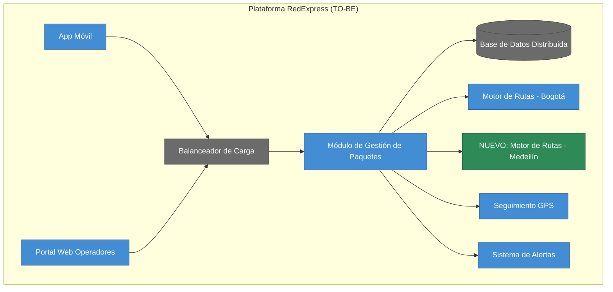
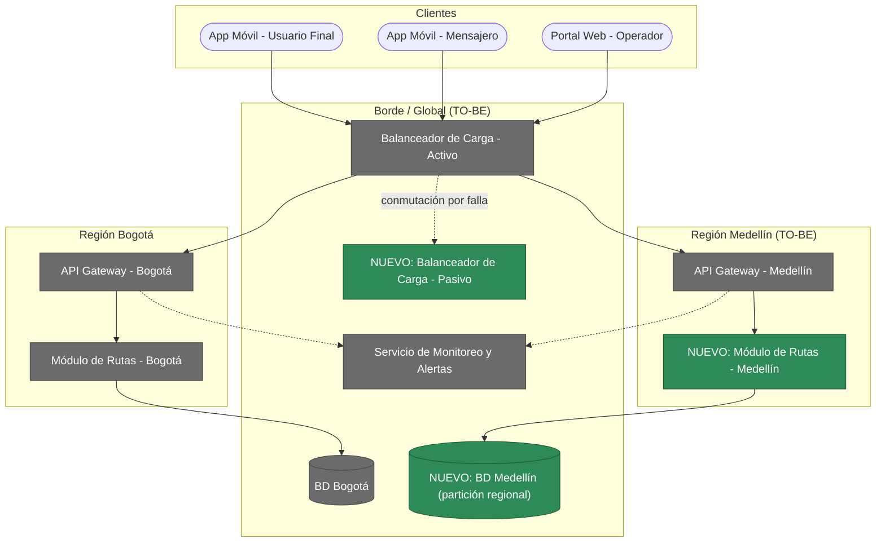
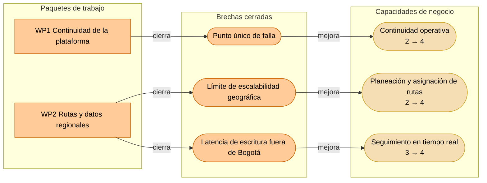
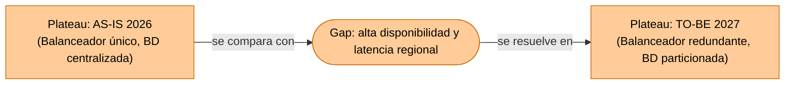

# Guía Paso a Paso: Opportunities & Solutions (Diseño del TO-BE y Análisis de Brechas)

Esta guía complementa el `README.md` del taller y sigue la estructura oficial de la actividad de mejora de arquitectura del curso (documento `Guia_Entrega_Mejora_Arquitectura.pdf`): **Diagnóstico inicial → Propuesta de mejoras → Visualización TO-BE → Análisis de beneficios y riesgos**. Este taller no crea un caso base nuevo: retoma el **AS-IS de RedExpress** ya construido en el Taller 3 (C1/C2) y el Taller 4 (mapa de infraestructura y diagnóstico) para proponer, por primera vez en el curso, una arquitectura objetivo (TO-BE) — y hacerlo *después* de haber pasado por seguridad (Taller 5) y normatividad (Taller 6), no antes.

**Por qué este taller va aquí y no antes:** proponer un TO-BE sin haber hecho el análisis de riesgos y de cumplimiento es diseñar a ciegas. TOGAF ADM no reserva el TO-BE para el final del proyecto, pero tampoco lo dibuja sin haber consolidado los hallazgos de cada dominio — por eso Opportunities & Solutions viene después de Negocio, Datos, Aplicaciones, Infraestructura, Seguridad y Normatividad, y antes de Integración de Vistas y la presentación final.

Los diagramas de ejemplo están escritos en [Mermaid](https://mermaid.js.org/) y se renderizan automáticamente al ver este archivo en GitHub.

---

## 1. Qué es una brecha (gap) en este taller

| Tipo de brecha | Se identifica en | Ejemplo |
|---|---|---|
| Funcional / Aplicaciones | Taller 3 (C1/C2 AS-IS) | Falta un contenedor que resuelva una limitación del sistema actual |
| Técnica / Infraestructura | Taller 4 (mapa + diagnóstico) | Punto único de falla, cuello de botella, límite de escalabilidad |
| Seguridad | Taller 5 (STRIDE) | Amenaza identificada sin mitigación implementada |
| Cumplimiento | Taller 6 (checklist normativo) | Ítem marcado como "Brecha" en el checklist |

Una brecha real siempre se puede señalar en un entregable anterior. Si no puede decir de qué taller salió, probablemente no es una brecha sino una opinión.

---

## 2. Metodología en 4 partes

Esta metodología sigue exactamente la estructura de la actividad oficial de mejora de arquitectura del curso — el documento de un solo entregable (máx. 6 páginas + anexos) que el docente evalúa con la rúbrica del `README.md`:

1. **Diagnóstico inicial** — responda las tres preguntas orientadoras: ¿qué procesos o tecnologías generan mayor fricción en la operación?, ¿qué problemas recurrentes señalaron los usuarios o el cliente?, ¿qué vulnerabilidades o riesgos quedaron evidenciados en el análisis previo (brechas técnicas de los Talleres 3-4, amenazas STRIDE del Taller 5, brechas normativas del Taller 6)? El resultado esperado es un resumen breve — una "foto" del problema actual — que sirve de base para proponer mejoras.
2. **Propuesta de mejoras** — abra el espectro sin censura inicial: haga primero una lluvia de ideas de al menos 6 mejoras (procesos, comunicación con el cliente, tecnología, seguridad — no solo infraestructura), y luego priorice 2-3 con justificación, distinguiendo quick wins de mejoras de mayor impacto o largo plazo. Cuando una brecha priorizada admita varias soluciones, decida entre ellas con una **matriz de decisión ponderada** (sección 2.1).
3. **Visualización TO-BE** — represente cómo se transforma el proceso actual en uno más ágil o seguro (BPMN o diagrama simple) y qué cambios de aplicaciones, infraestructura y flujos de información se introducen (C4/ArchiMate), señalando explícitamente qué controles de seguridad del Taller 5 se integran.
4. **Análisis de beneficios y riesgos** — construya una matriz de brechas cerradas y beneficios esperados, y contrástela con una tabla de riesgos, limitaciones o dependencias que podrían impedir la implementación. Cierre agrupando las brechas por **capacidad de negocio** y organizándolas en paquetes de trabajo (sección 4.1).

---

## 3. Ejemplo guiado: TO-BE de RedExpress

### Parte 1 — Diagnóstico inicial

Se responde primero a las tres preguntas orientadoras, apoyándose en lo ya diagnosticado en el AS-IS de RedExpress:

| Pregunta orientadora | Respuesta para RedExpress | Taller de origen |
|---|---|---|
| ¿Qué procesos o tecnologías generan mayor fricción en la operación? | El balanceador de carga único y la base de datos con escritura centralizada en Bogotá generan lentitud y riesgo de caída total ante picos de demanda (ej. campañas de fin de año). | Taller 4 |
| ¿Qué problemas recurrentes señalan los usuarios o el cliente? | Los usuarios de Medellín reportan demoras en la asignación de rutas porque toda solicitud depende del motor de rutas de Bogotá. | Taller 4 |
| ¿Qué vulnerabilidades de seguridad o riesgos quedaron evidenciados en el análisis previo? | Punto único de falla en el balanceador, cuello de botella de escritura en la BD, límite de escalabilidad geográfica en Medellín. | Taller 4 |

Esto se traduce en la misma lista de riesgos/brechas ya diagnosticados en la guía de infraestructura del Taller 4:

| Riesgo / Brecha | Taller de origen | Tipo |
|---|---|---|
| Balanceador de Carga (instancia única) | Taller 4 | Técnica |
| Base de Datos Distribuida (escritura única en Bogotá) | Taller 4 | Técnica |
| Región Medellín sin módulo de rutas propio | Taller 4 | Técnica / Funcional |

> **En su proyecto con el cliente real**, responda las tres preguntas orientadoras sumando también las brechas de seguridad (Taller 5) y de cumplimiento normativo (Taller 6) — el ejercicio de clase se enfoca solo en las brechas técnicas de RedExpress porque son las que ya están completamente diagnosticadas en el curso.

### Parte 2 — Propuesta de mejoras (lluvia de ideas y priorización)

**Lluvia de ideas (sin censura inicial):** antes de elegir qué construir, el equipo genera una lista amplia de posibles mejoras para RedExpress sin descartar ninguna todavía. Algunas son cambios técnicos; otras son ajustes de proceso o de comunicación con el cliente que ni siquiera requieren tocar la infraestructura:

| # | Idea de mejora | Tipo |
|---|---|---|
| 1 | Balanceador de carga redundante (activo-pasivo) | Técnica |
| 2 | Base de datos particionada por región | Técnica |
| 3 | Módulo de rutas propio en Medellín | Técnica / Funcional |
| 4 | Notificaciones proactivas al cliente cuando se detecta una demora prevista en la entrega | Proceso / Comunicación |
| 5 | Checklist digital de verificación del paquete en el punto de entrega, firmado por el mensajero | Proceso |
| 6 | Encuesta corta de satisfacción integrada en la app, justo después de cada entrega | Proceso / Comunicación |
| 7 | Canal de WhatsApp o chatbot para consultar el estado de un envío sin llamar a soporte | Proceso / Comunicación |
| 8 | Panel unificado de monitoreo para operadores, con alertas por región | Técnica (mediano plazo) |

**Priorización (2-3 ideas seleccionadas, con justificación):** de las 8 ideas anteriores, el equipo prioriza las 3 mejoras técnicas porque son las únicas con una brecha ya diagnosticada y evidenciada en el Taller 4 (trazabilidad directa AS-IS → TO-BE). Las ideas de proceso (4-7) son válidas y de bajo esfuerzo (quick wins), pero quedan como backlog para una siguiente iteración porque todavía no tienen un hallazgo formal que las respalde en este curso.

> **En su cliente real**, si una idea de proceso responde a un problema recurrente detectado en entrevistas (pregunta orientadora 2 del Diagnóstico), sí debe priorizarla aquí con la misma justificación — no descarte una mejora solo por ser "de proceso" en vez de técnica.

> **Si alguna idea es un agente de IA** (como la #7, un chatbot que responde consultas), no la modele como una caja negra: use el [patrón de sistemas agénticos](https://github.com/CesarAVegaF312/AREM-ArchiMate/blob/main/patron_sistemas_agenticos.md) de la guía ArchiMate para mostrar qué herramientas invoca y qué riesgos propios de estos sistemas (alucinación, autonomía sin supervisión) hay que evaluar en la Parte 4.

| Solución priorizada | Esfuerzo | Impacto | Quick win / Largo plazo | Prioridad |
|---|---|---|---|---|
| Balanceador redundante | Medio | Alto | Quick win | 1 |
| BD particionada por región | Alto | Alto | Largo plazo | 2 |
| Módulo de rutas en Medellín | Alto | Medio | Largo plazo | 3 |

#### 2.1 Cuando una brecha tiene varias soluciones posibles: la matriz de decisión ponderada

La tabla de arriba responde "¿qué brechas atendemos primero?". Pero una vez elegida una brecha, casi siempre hay **más de una forma de cerrarla**, y ahí la intuición ("yo prefiero la opción B") no alcanza para defenderse ante un comité. Esta subsección enseña el método para decidir con criterio. Es el marco de decisión de 8 pasos del Módulo 8 (Gobierno de Arquitectura), que se aplica aquí porque **este es el taller donde se decide**; el Taller 9 solo se ocupa de dejar la decisión registrada (ADR) y gobernada.

**La decisión de ejemplo.** De las tres mejoras priorizadas, tomamos la #1 (balanceador redundante) y la llevamos hasta el final: ¿*cómo* exactamente se elimina el punto único de falla del balanceador? Los valores en dólares, semanas y envíos por hora son **supuestos del ejemplo** para poder hacer cuentas; en su proyecto real los reemplaza con datos del cliente.

**Paso 1 — Enunciar el problema en términos de impacto, no de solución.**

| Enunciado | ¿Sirve? | Por qué |
|---|---|---|
| «Necesitamos un segundo balanceador de carga» | No | Ya es una solución disfrazada de problema: cierra las demás opciones antes de compararlas |
| «Si el balanceador cae durante la campaña de fin de año, toda la plataforma queda inaccesible en el país: en el pico de ~1.200 envíos/hora, cada hora de caída deja esos envíos sin asignar y sin seguimiento» | Sí | Dice qué se pierde, cuándo y cuánto; no menciona ninguna herramienta |

Regla práctica: si su enunciado contiene el nombre de una tecnología o la palabra «necesitamos», reescríbalo.

**Paso 2 — Ubicar el último momento responsable para decidir.** Decidir demasiado pronto cierra opciones que aún no hacía falta cerrar; decidir tarde deja al equipo sin tiempo. Se calcula hacia atrás desde la fecha en que el problema duele:

| Dato | Valor del ejemplo |
|---|---|
| La campaña de fin de año empieza el | 1 de noviembre |
| Lo que tarda la opción más probable (aprovisionamiento + pruebas de failover) | 6 semanas de implementación + 2 semanas de pruebas = 8 semanas |
| **Último momento responsable** | 1 de noviembre − 8 semanas ≈ **6 de septiembre** |
| Fecha de hoy (supuesto) | 25 de agosto → quedan ~12 días para decidir |

Consecuencia concreta: hay que decidir **esta semana o la siguiente**, no en octubre. Y sirve para descartar opciones: una opción que necesite 10 semanas de implementación más 2 de pruebas ya no llega a esta campaña.

**Paso 3 — Definir criterios y ponderarlos según lo que le importa al negocio.** Los criterios salen del problema del Paso 1; los **pesos salen del negocio, no del equipo técnico**. Cada criterio lleva una escala explícita (1 a 5, donde 5 siempre es lo más favorable), para que dos personas puntúen igual:

| Criterio | Peso | Qué significa 5 | Qué significa 1 |
|---|---|---|---|
| Disponibilidad lograda | 35 % | Ninguna caída perceptible ante la falla del balanceador | La falla sigue dejando la plataforma inaccesible |
| Costo total | 25 % | Menos de USD 100/mes adicionales | Más de USD 1.200/mes adicionales (4: 100-500 · 3: 500-800 · 2: 800-1.200) |
| Complejidad operativa | 20 % | No hay nada nuevo que operar | Sincronización y pruebas continuas entre componentes |
| Tiempo de implementación | 20 % | Menos de 1 semana | Más de 10 semanas (4: 2-3 sem. · 3: 4-6 sem. · 2: 7-10 sem.) |

Por qué esos pesos: el balanceador es el riesgo Alto de disponibilidad del Taller 4 (por eso 35 %); el presupuesto adicional es la dependencia principal de la Parte 4 (25 %); complejidad y tiempo pesan igual porque el equipo de plataforma es pequeño (20 % cada uno). Los pesos **siempre suman 100**.

**Paso 4 — Generar opciones: más de una, no más de tres, y al menos una radicalmente distinta.**

| Opción | Descripción |
|---|---|
| A | Balanceador **activo-pasivo** con failover automático: una segunda instancia espera y toma el tráfico si la primera cae |
| B | Balanceador **activo-activo**: dos instancias atienden tráfico a la vez, con almacén de sesión compartido |
| C | **Mantener el balanceador único** y reforzar el monitoreo (la opción radicalmente distinta: aceptar el riesgo y solo reducir el tiempo de detección) |

Incluir C no es relleno: obliga a que A y B demuestren que valen su costo frente a *no hacer casi nada*.

**Paso 5 — Pedir consejo a quien sabe y a quien le afecta.** Antes de puntuar, se consulta y se anota qué aportó cada uno:

| A quién | Qué aportó (ejemplo) | Qué opción afecta |
|---|---|---|
| Líder de infraestructura (sabe) | La conmutación activo-pasivo demora entre 30 y 60 s; el activo-activo exige un almacén de sesión compartido que hoy no existe | A y B |
| Proveedor cloud (sabe) | Cotiza la segunda instancia en ≈ USD 400/mes; el esquema activo-activo con almacén de sesión en ≈ USD 1.100/mes; monitoreo reforzado ≈ USD 60/mes | A, B, C |
| Jefe de operadores logísticos (le afecta) | 30-60 s de espera al conmutar es tolerable; una caída de más de 10 minutos en campaña, no | A vs. C |

**Paso 6 — Analizar trade-offs: puntuar cada opción contra cada criterio, y justificar cada celda.** Un número sin justificación es una opinión. Las justificaciones salen de las escalas del Paso 3 y de los datos del Paso 5:

| Opción | Disponibilidad | Costo | Complejidad | Tiempo |
|---|---|---|---|---|
| A · Activo-pasivo | **4** — conmuta solo, pero con una ventana de 30-60 s (no cero) | **4** — +USD 400/mes cae en el rango 100-500 | **4** — un componente nuevo con un procedimiento de failover simple | **3** — 4-6 semanas de aprovisionamiento y pruebas |
| B · Activo-activo | **5** — sin ventana de conmutación: ambos atienden tráfico | **2** — +USD 1.100/mes cae en el rango 800-1.200 | **2** — sincronizar sesiones y probar el balanceo continuamente | **2** — 8-10 semanas |
| C · Único + monitoreo | **1** — no elimina el punto único de falla, solo acorta el tiempo de detección | **5** — +USD 60/mes | **5** — no hay nada nuevo que operar | **5** — menos de 1 semana |

Ahora se multiplica cada puntaje por el peso de su criterio y se suma:

| Opción | Cálculo | **Total** |
|---|---|---|
| A · Activo-pasivo | 4×0,35 + 4×0,25 + 4×0,20 + 3×0,20 = 1,40 + 1,00 + 0,80 + 0,60 | **3,80** |
| B · Activo-activo | 5×0,35 + 2×0,25 + 2×0,20 + 2×0,20 = 1,75 + 0,50 + 0,40 + 0,40 | **3,05** |
| C · Único + monitoreo | 1×0,35 + 5×0,25 + 5×0,20 + 5×0,20 = 0,35 + 1,25 + 1,00 + 1,00 | **3,60** |

**Cómo leer este resultado (lo que más se olvida):**

1. **No mire solo el total.** C queda segunda con 3,60 a pesar de no resolver el problema del Paso 1: gana puntos en tres criterios "baratos" que compensan su 1 en disponibilidad. Por eso conviene un **criterio eliminatorio**: «toda opción con Disponibilidad menor a 3 se descarta, sin importar su total». Con esa regla C sale del juego y la decisión real es entre A y B.
2. **Pruebe la sensibilidad.** ¿Qué pasa si los pesos cambian? Con costo 35 %, complejidad 25 %, tiempo 25 % y disponibilidad solo 15 %, los totales pasan a A = 3,75, B = 2,45 y **C = 4,40**: ganaría no hacer nada. Moraleja: si el resultado se invierte con pesos razonables, el desacuerdo real no está en las opciones sino en **qué valora el negocio**, y esa conversación hay que tenerla con el cliente antes de decidir. (En la [versión visual](visualizacion-opportunities-solutions.html) puede mover los pesos con deslizadores y ver el cambio en vivo.)
3. **Una diferencia pequeña no es una victoria.** Si dos opciones quedan a menos de 0,3 puntos, trátelas como empate y decida por el criterio más crítico o por el riesgo de reversión.

**Paso 7 — Decidir y comunicar con su razón.** La decisión se escribe con su trade-off, para que quien la lea dentro de un año entienda qué se sacrificó:

> **Decisión:** implementar un balanceador activo-pasivo con failover automático (opción A). **Trade-off aceptado:** se sacrifica la conmutación instantánea (ventana de 30-60 s) a cambio de menor costo y menor complejidad operativa que el activo-activo. **Alternativas descartadas:** B, por costo (+USD 1.100/mes) y por no llegar a la campaña (8-10 semanas + pruebas); C, por no eliminar el punto único de falla (falla el criterio eliminatorio de disponibilidad).

**Paso 8 — Reevaluar: fijar de una vez cuándo se vuelve a mirar.** Ejemplo: «revisar la decisión después de la campaña de fin de año, o antes si el tráfico crece 30 % sobre el pico registrado; si eso ocurre, reconsiderar B». Una decisión sin fecha o disparador de revisión se vuelve dogma.

**Cómo se conecta con el resto del curso.** Esta decisión, con su contexto, alternativas descartadas y consecuencias, es exactamente el borrador de una **ADR** (Architecture Decision Record). En el Taller 9 se formaliza el registro; aquí se hace el trabajo intelectual de llegar a ella. Use la [plantilla de matriz de decisión](../plantillas/plantilla_matriz_decision.md) para hacer este ejercicio con su cliente real (una matriz por cada brecha que tenga más de una solución posible; no la necesita para brechas con una sola solución obvia).

#### 2.2 La IA como copiloto de la decisión (co-inteligencia)

Una herramienta de IA generativa puede acelerar casi todos los pasos de 2.1, y bien usada mejora la decisión: amplía las opciones y ataca los supuestos. Mal usada, produce una decisión que suena segura y que nadie sabe defender. La regla que ordena todo lo demás es una sola: **la IA propone; el equipo justifica y decide.** La responsabilidad de cada puntaje, de cada peso y de la decisión final sigue siendo de personas, porque es el equipo quien tendrá que defenderla ante el comité.

**Qué se le pide a la IA en cada paso, y qué revisa el equipo:**

| Paso del método | Qué se le pide a la IA | Qué revisa el equipo antes de aceptarlo |
|---|---|---|
| 4 · Generar opciones | Opciones adicionales, en especial una radicalmente distinta a las que ya tiene | Que sean viables con las restricciones reales (presupuesto, plazo, equipo); una idea de la IA es una hipótesis, no una opción hasta que se verifica con quien sabe |
| 6 · Puntuar | Un borrador de puntajes con su razón | Cada puntaje contra la escala del Paso 3 y los datos del Paso 5; se corrige lo que no coincida |
| 7 · Decidir | Que **ataque** la decisión: qué supuesto, si falla, la invalida y con qué pesos ganaría otra opción | Que lo que la IA afirma se **recalcule**: sus cifras y sus conclusiones pueden ser incorrectas |
| Registro (hacia la ADR) | Un borrador de la decisión en formato ADR | Que estén las alternativas descartadas con su razón, las consecuencias negativas y que no haya datos inventados |

**Ejemplo con la decisión del balanceador de RedExpress.**

*1. Pedir una opción radicalmente distinta (Paso 4).* El equipo ya tiene A, B y C, y le da a la IA el problema del Paso 1, las restricciones (campaña el 1 de noviembre, presupuesto limitado, equipo pequeño) y las tres opciones descartables. Le pide: «proponga tres formas distintas de eliminar el punto único de falla, con los supuestos de cada una». Suponga que responde, entre otras, «usar un servicio de balanceo administrado por el proveedor cloud». **Eso todavía no es la opción D:** es una hipótesis. El equipo la convierte en opción solo después de preguntarle al proveedor cloud (Paso 5) cuánto cuesta, cuánto tarda y cuánta conmutación ofrece. Si el proveedor lo confirma, entra a la matriz con puntajes justificados; si no, se descarta y queda anotado por qué.

*2. Borrador de puntajes contra datos verificados (Paso 6).* Para evitar el **anclaje** (aceptar el número de la IA solo porque llegó primero), el equipo puntúa **primero por su cuenta** y después compara con la IA. Las diferencias son la parte útil:

| Celda | Propuesta de la IA | Dato verificado con quien sabe | Puntaje final | Quién corrigió |
|---|---|---|---|---|
| A · Costo | 4, «≈ USD 300/mes» | El proveedor cotizó ≈ USD 400/mes (sigue en el rango 100-500) | 4 | Equipo: corrige la cifra, el puntaje se mantiene |
| B · Tiempo | 3, «4-6 semanas» | El líder de infraestructura estima 8-10 semanas | 2 | Equipo: corrige el puntaje |
| B · Complejidad | 3 | Requiere almacén de sesión compartido que hoy no existe (Paso 5) | 2 | Equipo: corrige el puntaje |

Sin esta comparación, B habría quedado con 3,45 en vez de 3,05, y la conversación sobre el costo real se habría perdido.

*3. Pedirle que ataque la decisión (Paso 7).* El equipo le entrega la matriz, los pesos y la decisión A, y le pide: «ataque esta decisión: ¿qué supuesto la invalida? ¿con qué pesos ganaría B?». Suponga que la IA responde: «si la disponibilidad pesara 50 %, ganaría B». **El equipo no lo acepta: lo recalcula** (repartiendo el resto del peso en partes iguales):

| Peso de Disponibilidad | Total A | Total B | ¿Quién gana? |
|---|---|---|---|
| 35 % (pesos del negocio: 25 / 20 / 20 para el resto) | 3,80 | 3,05 | A |
| **50 %** (lo que afirmó la IA) | **3,83** | **3,50** | **A: la afirmación de la IA es falsa** |
| 62,5 % | 3,88 | 3,88 | Empate |
| 70 % | 3,90 | 4,10 | B |

La IA se equivocó en el umbral, pero la pregunta sí era buena, y el recálculo da una respuesta más útil que la suya: **B solo gana si el negocio pesa la disponibilidad por encima de ~62 %.** Eso le da al comité una frase concreta para decidir: «si ustedes consideran que la disponibilidad vale más del 62 % de la decisión, cambiamos a B; si no, A». Esta es la lección central: la IA es muy buena generando la pregunta incómoda y poco confiable dando la cifra, por eso se recalcula siempre.

*4. Borrador de ADR (Registro).* Se le pide a la IA convertir la decisión en formato ADR (Contexto, Problema, Decisión, Alternativas, Consecuencias). El equipo revisa que incluya B y C **con su razón de descarte**, que las consecuencias incluyan lo negativo (la ventana de 30-60 s) y que ninguna cifra sea nueva: todo debe salir de la matriz.

**Prompts listos para usar.** La [biblioteca de prompts](../plantillas/prompts_ia_decision.md) trae 12 prompts, uno por cada paso de este taller (diagnóstico, ideas, criterios, contraste de puntajes, abogado del diablo, riesgos, ADR, capacidades y revisor del entregable), cada uno con sus campos por completar y una lista de qué revisar en la respuesta.

**Reglas para usar la IA en esta decisión:**

1. **La IA propone, el equipo justifica.** Ningún puntaje ni recomendación se acepta sin la razón de una persona.
2. **Los pesos no se delegan.** Salen del negocio; la IA puede ayudar a probar sensibilidad, no a decidir qué importa.
3. **Todo número o afirmación de la IA se verifica o se recalcula** antes de entrar a la matriz. Los costos, plazos y cifras que da con aplomo pueden estar inventados.
4. **Puntúe primero usted, compare después.** Así evita el anclaje.
5. **Pida también la contra-opinión.** Las herramientas tienden a favorecer la opción más popular o "estándar": pídale explícitamente opciones que la contradigan.
6. **Cuide la confidencialidad del cliente.** Anonimice nombres, cifras internas y datos personales, o confirme por escrito que el cliente autoriza usar la herramienta.
7. **Registre el uso de la IA:** qué se le pidió, qué propuso y qué cambió el equipo (basta una tabla como la del ejemplo). Es lo que mantiene trazable la decisión.

**Cuando la solución que se está decidiendo incluye IA.** Si una de las opciones es un agente o un asistente (como la idea #7, el chatbot de RedExpress), la matriz necesita criterios adicionales, porque las opciones sin IA no los enfrentan:

| Criterio adicional | Qué se evalúa | Dónde profundizar |
|---|---|---|
| Autonomía y supervisión humana | ¿Puede ejecutar acciones o solo responder? ¿Qué acciones exigen aprobación humana? | [Patrón de sistemas agénticos](https://github.com/CesarAVegaF312/AREM-ArchiMate/blob/main/patron_sistemas_agenticos.md) |
| Tríada letal | ¿Combina acceso a datos privados, contenido no confiable y capacidad de comunicar hacia afuera? Basta romper una de las tres | Taller 5 (MITRE ATLAS y ejemplo de código) |
| Fiabilidad | Qué pasa cuando alucina o se equivoca, y quién lo detecta | Taller 6 si maneja datos personales |
| Costo variable y dependencia | El costo por uso crece con el volumen; el proveedor del modelo es una dependencia externa | Riesgos de la Parte 4 |

### Parte 3 — Visualización TO-BE

**TO-BE de Aplicaciones:** se extiende el C2 del Taller 3 agregando un **Módulo de Procesamiento de Rutas y Paquetes - Medellín**, réplica del de Bogotá, para que la región deje de depender de un solo punto de procesamiento.

**TO-BE de Tecnología:** se extiende el mapa del Taller 4: el balanceador pasa a ser redundante (activo-pasivo) y la base de datos se particiona por región para reducir la dependencia de una única escritura centralizada en Bogotá.

**Véalo interactivo:** en la [versión visual de este taller](visualizacion-opportunities-solutions.html) puede alternar AS-IS/TO-BE sobre este mismo diagrama de tecnología y hacer clic en cualquier elemento (nuevo o existente) para ver qué brecha resuelve, el beneficio esperado y el riesgo de implementarlo.

**Controles de seguridad integrados:** el ejemplo guiado de RedExpress de este curso no tiene un Taller 5 construido específicamente para este caso (el ejemplo guiado de STRIDE del Taller 5 usa un sistema académico distinto, no RedExpress). *En su cliente real, incluya aquí los controles de seguridad del Taller 5 que apliquen a este TO-BE* — por ejemplo, si alguna de sus mitigaciones STRIDE (rate limiting, cifrado en tránsito/reposo, RBAC, auditoría) protege directamente uno de los componentes que este TO-BE modifica, decláralo explícitamente y trace la relación, tal como lo pide el documento oficial de la actividad.

### Parte 4 — Análisis de beneficios y riesgos

**Brechas cerradas y beneficios esperados:**

| AS-IS | TO-BE | Brecha que cierra | Beneficio esperado |
|---|---|---|---|
| Balanceador único | Balanceador redundante (activo-pasivo) | Punto único de falla | Alta disponibilidad de toda la plataforma |
| BD con escritura única en Bogotá | BD particionada por región | Cuello de botella de latencia | Mejor rendimiento del rastreo en tiempo real fuera de Bogotá |
| Medellín sin módulo de rutas propio | Módulo de rutas replicado en Medellín | Límite de escalabilidad geográfica | La región puede crecer sin saturar Bogotá |

**Riesgos, limitaciones y dependencias de implementación:** ninguna mejora es gratis. Antes de dar por buena la priorización, el equipo contrasta cada solución con lo que podría impedir o retrasar su implementación:

| Solución | Riesgo / limitación / dependencia |
|---|---|
| Balanceador redundante | Depende de la aprobación de presupuesto adicional del proveedor cloud para la segunda instancia; si no se aprueba, la mejora no puede iniciar en el plazo previsto. |
| BD particionada por región | Requiere una migración con ventana de mantenimiento; existe riesgo de downtime parcial y de inconsistencia de datos durante la sincronización inicial entre particiones. |
| Módulo de rutas en Medellín | Depende de contratar o reasignar personal técnico en la región; sin ese equipo local, el módulo replicado no tiene quién lo opere ni lo mantenga. |

#### 4.1 Agrupar las brechas por capacidad y armar paquetes de trabajo

Hasta aquí las brechas están listadas una por una. Pero el negocio no piensa en "balanceador" ni en "partición de base de datos": piensa en **lo que la empresa necesita saber hacer** (sus capacidades). Agrupar las brechas por capacidad cumple dos cosas: le muestra al cliente el beneficio en su lenguaje, y decide qué brechas se implementan juntas (un *paquete de trabajo*) porque mejoran la misma capacidad.

**Primero, no confunda tres cosas que suenan parecido:**

| Concepto | Pregunta que responde | Ejemplo en RedExpress | Dónde ya lo construyó |
|---|---|---|---|
| Capacidad | ¿Qué debe saber hacer la empresa? (verbo + objeto, sin tecnología) | Planear y asignar rutas | Ficha del cliente, Taller 0 (procesos clave) |
| Proceso | ¿Cómo se hace, paso a paso, y quién lo hace? | «Asignar ruta a un mensajero» (diagrama BPMN) | Taller 1 |
| Aplicación | ¿Qué sistema lo soporta? | Motor de Rutas (contenedor C2) | Taller 3 |

Una capacidad la soportan varios procesos y varias aplicaciones, y **sobrevive** aunque cambien las herramientas: RedExpress seguirá necesitando "planear y asignar rutas" aunque reemplace el Motor de Rutas. Por eso es la unidad correcta para hablar de mejora con el negocio.

**Paso 1 — Liste 5 a 8 capacidades** a partir de los procesos clave de su ficha de cliente (Taller 0). Nómbrelas con verbo + objeto. Si su lista tiene nombres de sistemas ("CRM", "ERP"), está listando aplicaciones, no capacidades.

**Paso 2 — Evalúe la madurez de cada capacidad hoy (AS-IS) y la que se espera tras las mejoras (TO-BE)**, en una escala 1-5 (1 = se hace de forma ad hoc y frágil · 3 = funciona pero con fallas conocidas · 5 = fiable, medida y escalable). La puntuación del AS-IS se justifica con los hallazgos de los Talleres 3-6, no con impresión.

| Capacidad | Madurez AS-IS | Madurez TO-BE | Qué la explica |
|---|---|---|---|
| Recepción y registro de envíos | 4 | 4 | Sin brechas diagnosticadas; no se toca en esta iteración |
| Planeación y asignación de rutas | 2 | 4 | Medellín depende del motor de Bogotá y se demora (Taller 4) |
| Seguimiento en tiempo real | 3 | 4 | Funciona, pero la escritura centralizada en Bogotá lo hace lento fuera de allí |
| Notificación y atención al cliente | 3 | 3 | Sin brecha formal; las ideas #4 y #7 quedaron en backlog |
| Continuidad operativa de la plataforma | 2 | 4 | Punto único de falla en el balanceador |

**Paso 3 — Conecte cada brecha con la capacidad que mejora, y agrupe en paquetes de trabajo.** Regla: una brecha va al paquete de la capacidad que más mejora; si mejora dos, declárelo. Un paquete también se ordena por su esfuerzo (quick win primero):

| Paquete de trabajo | Brechas que incluye | Capacidad que mejora | Tipo |
|---|---|---|---|
| WP1 · Continuidad de la plataforma | Balanceador redundante activo-pasivo (decisión de 2.1) | Continuidad operativa (2 → 4) | Quick win · 4-6 semanas |
| WP2 · Rutas y datos regionales | Módulo de rutas en Medellín + BD particionada por región | Planeación y asignación de rutas (2 → 4) y Seguimiento en tiempo real (3 → 4) | Largo plazo |

Esta vista es la que el Taller 9 convierte en el roadmap: cada paquete de trabajo se vuelve una fase con esfuerzo, duración, responsable y mitigación de riesgo. También es la forma más clara de responder al comité «¿qué gana el negocio?»: no "un balanceador redundante", sino "la continuidad operativa sube de 2 a 4".

> Esta tabla priorizada (esfuerzo, impacto y ahora riesgos) es exactamente el insumo del **Plan de Implementación** del Taller 9 — no se vuelve a analizar desde cero, solo se traduce a fases con esfuerzo, duración, responsable y mitigación de riesgo.

---

## 4. Errores comunes a evitar

| Error frecuente | Por qué es un problema | Cómo corregirlo |
|---|---|---|
| Proponer el TO-BE sin partir de brechas concretas del AS-IS | El diseño se vuelve una lista de deseos, no una solución a un problema diagnosticado | Cada elemento del TO-BE debe corregir una brecha específica listada en la Parte 1 (Diagnóstico) |
| Ignorar las brechas de seguridad y cumplimiento (Talleres 5 y 6) | El TO-BE queda técnicamente atractivo pero inseguro o ilegal | Incluya siempre brechas de STRIDE y Normatividad en el diagnóstico, no solo técnicas |
| Saltar directo a la solución sin lluvia de ideas previa | Se pierden mejoras de proceso o quick-win que no requieren tocar infraestructura, y la priorización final parece arbitraria | Genere primero al menos 6 ideas sin censura (Parte 2) y solo después reduzca a 2-3 con justificación |
| Priorizar solo por impacto, sin considerar esfuerzo | Se proponen soluciones inviables en el tiempo del proyecto | Cruce impacto y esfuerzo al priorizar, distinguiendo quick wins de mejoras de largo plazo (Parte 2) |
| TO-BE que no se puede rastrear al AS-IS original | El comité no puede evaluar si la solución realmente resuelve el problema | Use el mismo nombre de los componentes del AS-IS al proponer el cambio (Parte 3) |
| Documentar solo beneficios y omitir los riesgos de implementación | El comité aprueba una solución sin conocer sus dependencias reales (presupuesto, ventanas de mantenimiento, personal) y estas se descubren tarde | Incluya siempre una tabla de riesgos/limitaciones frente a los beneficios (Parte 4) |
| Elegir entre opciones "porque se ve mejor", sin matriz | La decisión no se puede defender ni reconstruir cuando alguien pregunte por qué (Parte 2.1) | Puntúe cada opción contra criterios ponderados, con justificación por celda |
| Que el equipo técnico fije los pesos de los criterios | El resultado refleja lo que le importa al equipo, no al cliente; con otros pesos puede invertirse | Los pesos los define o valida el negocio; pruebe la sensibilidad con pesos alternativos |
| Puntajes sin justificación ("le puse 4") | Es una opinión con apariencia de número | Cada celda cita la escala del criterio o el dato consultado |
| Aceptar los puntajes, cifras o conclusiones de una IA sin verificarlos | Puede afirmar con aplomo un dato inventado o un umbral equivocado (Parte 2.2) | Recalcule sus afirmaciones, contraste sus cifras con quien sabe y puntúe primero usted |
| Comparar solo opciones parecidas entre sí | Nadie prueba si "no hacer casi nada" ya resolvía el problema | Incluya al menos una opción radicalmente distinta (por ejemplo, aceptar el riesgo) |
| Listar capacidades con nombres de sistemas ("CRM", "Motor de Rutas") | Son aplicaciones, no capacidades; la mejora pierde su lenguaje de negocio (Parte 4.1) | Nombre las capacidades con verbo + objeto, sin tecnología |

---

## 5. Checklist de autoevaluación antes de entregar

- [ ] Se respondieron explícitamente las tres preguntas orientadoras del diagnóstico (fricción, problemas recurrentes, vulnerabilidades/riesgos previos).
- [ ] Se consolidaron las brechas de los Talleres 3, 4, 5 y 6 (no solo las técnicas).
- [ ] Se hizo una lluvia de ideas de al menos 6 mejoras antes de priorizar 2-3.
- [ ] El TO-BE de Aplicaciones extiende explícitamente el C2 del Taller 3, no lo reemplaza desde cero.
- [ ] El TO-BE de Tecnología extiende explícitamente el mapa del Taller 4, no lo reemplaza desde cero.
- [ ] Se señaló explícitamente qué control de seguridad del Taller 5 se integra en el TO-BE.
- [ ] Cada elemento del TO-BE está trazado a una brecha específica del AS-IS.
- [ ] Las soluciones están priorizadas por impacto y esfuerzo, distinguiendo quick wins de mejoras de largo plazo.
- [ ] Cada brecha con más de una solución posible tiene su matriz de decisión: problema en términos de impacto, último momento responsable, criterios con escala y pesos definidos por el negocio, 2-3 opciones (una radicalmente distinta) y puntajes justificados celda por celda.
- [ ] La decisión registra el trade-off aceptado, las alternativas descartadas con su razón y cuándo se vuelve a evaluar.
- [ ] Se probó qué pasa si cambian los pesos (sensibilidad) y se definió si hay un criterio eliminatorio.
- [ ] Si se usó IA: cada cifra o afirmación suya se verificó o recalculó, los pesos los fijó el negocio, se cuidó la confidencialidad del cliente y quedó registrado qué propuso la IA y qué cambió el equipo.
- [ ] Si alguna opción incluye un agente o asistente de IA, la matriz tiene criterios adicionales (autonomía y supervisión humana, tríada letal, fiabilidad, costo variable).
- [ ] Las brechas están agrupadas por capacidad de negocio (con madurez AS-IS y TO-BE) y organizadas en paquetes de trabajo.
- [ ] El análisis incluye riesgos/limitaciones que podrían impedir la implementación, no solo beneficios.
- [ ] La matriz de brechas queda lista para alimentar el Plan de Implementación del Taller 9.

---

## 6. Vista ArchiMate equivalente

Este es el taller donde ArchiMate deja de ser "una notación más" y se vuelve la herramienta correcta para el trabajo: la capa de **Implementación y Migración** (ver la [Guía de Notación ArchiMate](https://github.com/CesarAVegaF312/AREM-ArchiMate/blob/main/guia_notacion_archimate.md)) tiene elementos diseñados exactamente para un análisis de brechas — **Plateau** (un estado estable de la arquitectura) y **Gap** (la diferencia entre dos plateaus).

La matriz de brechas de la Parte 4 (Análisis de beneficios y riesgos) **es**, en el fondo, una lista de elementos `Gap`: cada fila conecta un `Plateau` AS-IS (lo diagnosticado en los Talleres 3-6) con un `Plateau` TO-BE (lo que este taller propone). Esos mismos `Gap` son los que el Taller 9 convierte en `Work Package` dentro del Plan de Implementación — la cadena completa en ArchiMate es: **Constraint/Requirement (Talleres 5-6) → Gap (este taller) → Work Package (Taller 9) → nuevo Plateau**.

Las capacidades de la sección 4.1 son elementos `Capability` de la capa de **Estrategia** de ArchiMate: cada `Gap` se relaciona con la `Capability` que mejora, y cada `Work Package` con los `Gap` que cierra — el mismo diagrama Mermaid de 4.1 es, en esencia, esa vista. La matriz de decisión de 2.1, en cambio, no se dibuja: su resultado queda como la ADR del Taller 9.

---

_Esta guía hace parte del Taller 7 de Opportunities & Solutions — curso Arquitectura Empresarial, Universidad de La Sabana._
